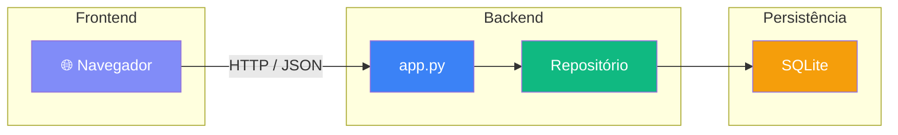

# 📚 Gerenciador de Estudos

Aplicação local de gerenciamento de tempo e tarefas de estudo, inspirada no Clockify. Roda completamente offline, sem necessidade de servidor externo ou conta em nuvem.

> Sou formado em Engenharia da Computação pela UnB e comecei a usar esse projeto em 2025 para me ajudar a estudar e organizar meu tempo. À medida que sentir necessidade, vou adicionando novas funcionalidades — essa é a primeira versão.

---

## ✨ Funcionalidades

- **Timer com pause/retomar** — cronômetro vinculado a uma matéria, com barra de progresso
- **Bloco de tempo** — alarme sonoro configurável (ex: 1h15m) para controle de sessão
- **Categorias por matéria** — cada matéria tem nome e cor personalizados
- **Gráficos por período** — barras (semana, mês, 6 meses, ano) e pizza (hoje, total)
- **Sessões recentes** — histórico editável com nota, horário de início e fim corrigíveis
- **Kanban de tarefas** — quadro com colunas "A fazer" e "Concluído", com drag and drop
- **Filtros de período** — Hoje, Semana, Mês, 6 meses, Ano e Total

---

## 🏗️ Arquitetura

O projeto segue uma arquitetura **cliente–servidor local**:



### Estrutura de arquivos

```
gerenciador-de-estudos/
├── .gitignore
├── README.md
├── requirements.txt
└── src/
    ├── app.py            # Servidor HTTP + roteamento de endpoints
    ├── database.py       # Conexão com SQLite e inicialização do banco
    ├── repositorio.py    # Classes de acesso a dados (padrão Repository)
    └── index.html        # Frontend completo (HTML + CSS + JS)
```

### Banco de dados (SQLite)

O arquivo `gerenciador_de_estudos.db` é criado automaticamente na primeira execução dentro de `src/`. Não é versionado (ver `.gitignore`).

| Tabela | Descrição |
|---|---|
| `categories` | Matérias com nome e cor |
| `sessions` | Sessões de estudo com início, fim, duração e nota |
| `settings` | Configurações gerais (ex: duração do bloco) |
| `tasks` | Tarefas do kanban com título e categoria |

---

## 🚀 Como executar

### Pré-requisitos

- Python 3.8 ou superior
- Navegador moderno (Chrome, Firefox, Edge, Safari)

### Passos

1. Clone o repositório:
   ```bash
   git clone https://github.com/seu-usuario/gerenciador-de-estudos.git
   cd gerenciador-de-estudos
   ```

2. Inicie o servidor:
   ```bash
   cd src
   python app.py
   ```

3. Acesse no navegador:
   ```
   http://localhost:8000
   ```

> O servidor imprime a URL no terminal quando inicia. Para encerrar, pressione `Ctrl+C`.

---

## 🔌 Endpoints da API

| Método | Rota | Descrição |
|---|---|---|
| GET | `/api/categories` | Lista todas as matérias |
| POST | `/api/categories` | Cria uma matéria |
| PUT | `/api/categories/:id` | Edita uma matéria |
| DELETE | `/api/categories/:id` | Remove uma matéria |
| GET | `/api/sessions?period=` | Lista sessões filtradas por período |
| POST | `/api/sessions/start` | Inicia uma sessão |
| POST | `/api/sessions/stop` | Encerra uma sessão |
| PUT | `/api/sessions/:id` | Edita horário/nota de uma sessão |
| DELETE | `/api/sessions/:id` | Remove uma sessão |
| GET | `/api/chart?period=` | Dados agregados para o gráfico |
| GET | `/api/stats?period=` | Estatísticas resumidas do período |
| GET | `/api/settings` | Lê configurações |
| PUT | `/api/settings` | Salva configurações |
| GET | `/api/tasks` | Lista tarefas pendentes |
| POST | `/api/tasks` | Cria uma tarefa |
| DELETE | `/api/tasks/:id` | Remove uma tarefa |

---

## 🛠️ Tecnologias

| Camada | Tecnologia |
|---|---|
| Servidor | Python 3 (`http.server` da stdlib) |
| Banco de dados | SQLite 3 (`sqlite3` da stdlib) |
| Frontend | HTML + CSS + JavaScript puro |
| Gráficos | [Chart.js 4.4](https://www.chartjs.org/) via CDN |
| Tipografia | [Inter](https://fonts.google.com/specimen/Inter) via Google Fonts |

Nenhuma dependência externa de Python — tudo que o backend precisa já vem na biblioteca padrão.