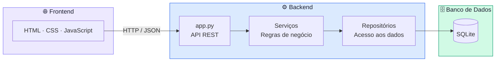

# 📚 Gerenciador de Estudos

Aplicação local de gerenciamento de tempo e tarefas de estudo, inspirada no Clockify. Roda completamente offline, sem necessidade de servidor externo ou conta em nuvem.

> Sou formado em Engenharia da Computação pela UnB e comecei a usar esse projeto em 2025 para me ajudar a estudar e organizar meu tempo. À medida que sentir necessidade, vou adicionando novas funcionalidades — essa é a quarta versão.

---

## ✨ Funcionalidades

- **Timer** com pause/retomar, alarme de bloco configurável e barra de progresso — borda do card pulsa na cor da matéria enquanto o cronômetro roda
- **Categorias** com cores únicas por matéria e destaque visual na sidebar
- **Gráficos interativos** com filtros por período (Hoje, Semana, Mês, 6 meses, Ano, Total) — barras com nomes de dias/meses, pizza para Hoje e Total
- **Filtro por legenda** — clicar numa matéria no gráfico oculta ela e recalcula as estatísticas em tempo real
- **Sessões agrupadas por matéria** — expandíveis, sincronizadas com o filtro de período, editáveis e excluíveis
- **Edição de sessões** — corrige horário de início, fim, categoria e nota de qualquer sessão passada
- **Kanban de tarefas** com drag and drop e undo de 4 segundos ao concluir
- **Cronograma semanal** — planejamento fixo por dia da semana vinculado às matérias
- **Bloco de estudo** — alarme sonoro configurável (ex: 1h15m) para gestão de tempo por bloco

---

## 🏗️ Arquitetura

O projeto segue uma arquitetura **cliente–servidor local** com quatro camadas bem definidas:



### Responsabilidades por camada

| Camada | Arquivo | Responsabilidade |
|---|---|---|
| Frontend | `index.html` + `style.css` + `app.js` | Interface, estado local, chamadas HTTP |
| Roteamento | `app.py` | Recebe requisições, despacha via `Roteador`, serializa JSON |
| Serviços | `servicos.py` | Regras de negócio, validações, mapeamento PT→EN |
| Repositórios | `repositorio.py` | Queries SQL parametrizadas, acesso ao banco |
| Banco | `database.py` | Conexão SQLite, inicialização do schema |

### Estrutura de arquivos

```
gerenciador-de-estudos/
├── .gitignore
├── README.md
├── requirements.txt
├── src/
│   ├── app.py            # Servidor HTTP + Roteador declarativo (19 rotas)
│   ├── servicos.py       # Camada de serviço — lógica de negócio
│   ├── repositorio.py    # Padrão Repository — acesso a dados
│   ├── database.py       # Conexão SQLite + inicialização do schema
│   ├── index.html        # Estrutura HTML (sem CSS ou JS embutidos)
│   ├── style.css         # Estilos
│   └── app.js            # Lógica de frontend
└── tests/
    ├── conftest.py           # Path setup + helpers compartilhados
    ├── test_repositorios.py  # Testes da camada de dados (banco isolado)
    ├── test_servicos.py      # Testes unitários de regras de negócio
    └── test_rotas.py         # Testes de integração HTTP (servidor real)
```

### Banco de dados

O arquivo `gerenciador_de_estudos.db` é criado automaticamente na primeira execução dentro de `src/`. Não é versionado (ver `.gitignore`).

| Tabela | Descrição |
|---|---|
| `categories` | Matérias com nome e cor |
| `sessions` | Sessões de estudo com início, fim, duração e nota |
| `settings` | Configurações gerais (duração do bloco de estudo) |
| `tasks` | Tarefas do kanban |
| `schedule` | Entradas do cronograma semanal |

---

## 🚀 Como executar

### Pré-requisitos

- Python 3.8 ou superior
- Navegador moderno (Chrome, Firefox, Edge, Safari)

### Passos

1. Clone o repositório:
   ```bash
   git clone https://github.com/seu-usuario/gerenciador-de-estudos.git
   cd gerenciador-de-estudos
   ```

2. Inicie o servidor:
   ```bash
   cd src
   python app.py
   ```

3. Acesse no navegador:
   ```
   http://localhost:8000
   ```

> O servidor imprime a URL no terminal quando inicia. Para encerrar, pressione `Ctrl+C`.

### Testes

```bash
# da raiz do projeto
pytest tests/ -v
```

---

## 🔌 Endpoints da API

| Método | Rota | Descrição |
|---|---|---|
| GET | `/api/settings` | Lê configurações |
| PUT | `/api/settings` | Salva configurações |
| GET | `/api/categories` | Lista todas as matérias |
| POST | `/api/categories` | Cria uma matéria |
| PUT | `/api/categories/:id` | Edita uma matéria |
| DELETE | `/api/categories/:id` | Remove uma matéria |
| GET | `/api/sessions?period=` | Lista sessões filtradas por período |
| POST | `/api/sessions/start` | Inicia uma sessão |
| POST | `/api/sessions/stop` | Encerra uma sessão |
| PUT | `/api/sessions/:id` | Edita horário/nota de uma sessão |
| DELETE | `/api/sessions/:id` | Remove uma sessão |
| GET | `/api/chart?period=` | Dados agregados para o gráfico |
| GET | `/api/stats?period=` | Estatísticas resumidas do período |
| GET | `/api/tasks` | Lista tarefas pendentes |
| POST | `/api/tasks` | Cria uma tarefa |
| DELETE | `/api/tasks/:id` | Remove uma tarefa |
| GET | `/api/schedule` | Lista entradas do cronograma |
| POST | `/api/schedule` | Adiciona matéria a um dia |
| DELETE | `/api/schedule/:id` | Remove entrada do cronograma |

---

## 🛠️ Tecnologias

| Camada | Tecnologia |
|---|---|
| Servidor | Python 3 (`http.server` da stdlib) |
| Banco de dados | SQLite 3 (`sqlite3` da stdlib) |
| Frontend | HTML + CSS + JavaScript puro |
| Gráficos | [Chart.js 4.4](https://www.chartjs.org/) via CDN |
| Tipografia | [Inter](https://fonts.google.com/specimen/Inter) via Google Fonts |
| Testes | [pytest](https://pytest.org/) |

Nenhuma dependência externa de Python — tudo que o backend precisa já vem na biblioteca padrão.
